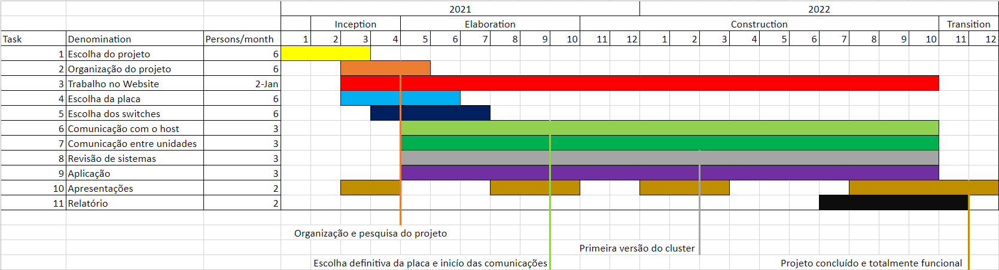

## Contexto

Este projeto enquadra-se no projeto Meshotron, que pretende criar um ASH para análise acústica de salas paralela.

## Problema

Análise da propagação de som numa sala demora demasiado tempo e consome demasiados recursos.

## Objetivos

Implementar o Meshotron em unidades computacionais de baixo custo.

Idealmente atingir velocidades perto de análise em tempo real para salas não muito grandes.

Tornar a análise sonora de uma sala mais financeiramente acessível.

## Tarefas

- Selecionar a placa
	+ Ter em conta os requisitos de comunicação
- Portar DWM para correr na placa
- Fazer o programa que distribui os dados pelo cluster
- Website

## Resultados esperados

Para um cluster de N nós obter um processamento N vezes mais rápido.

Idealmente este projeto comprovará a viabilidade de se converter este cluster num ASH.

## Trabalho relacionado

- Sara Barros e Guilherme Campos (2010) ‘Unidades ASH para paralelização de modelos acústicos DWM tridimensionais’. 6as Jornadas Portuguesas de Arquitecturas Reconfiguráveis (REC’2010), Aveiro, Fevereiro 2010.
-  Carlos Romeiro, Guilherme Campos e Arnaldo Oliveira (2011) ‘Design and Simulation of a Rectangular Meshotron Unit Prototype’. Symposium on Application Accelerators in High Performance Computing (SAAHPC’11), Knoxville, Tennessee, 19-21 Julho.
- Kris Wouk (2020) ‘Eight Awesome Raspberry Pi Clusters’. IoT Tech Trends.

## Calendário

## Plano de comunicação

- Site
- Github
- Jira
- Discord

## Distribuição de tarefas

Pela metodologia Agile será feita dinamicamente a cada sprint.
